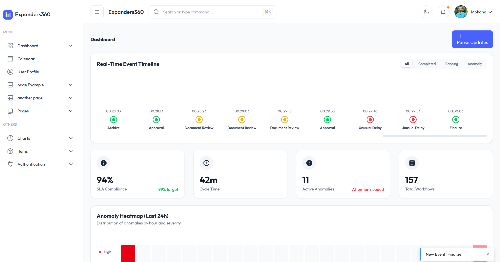
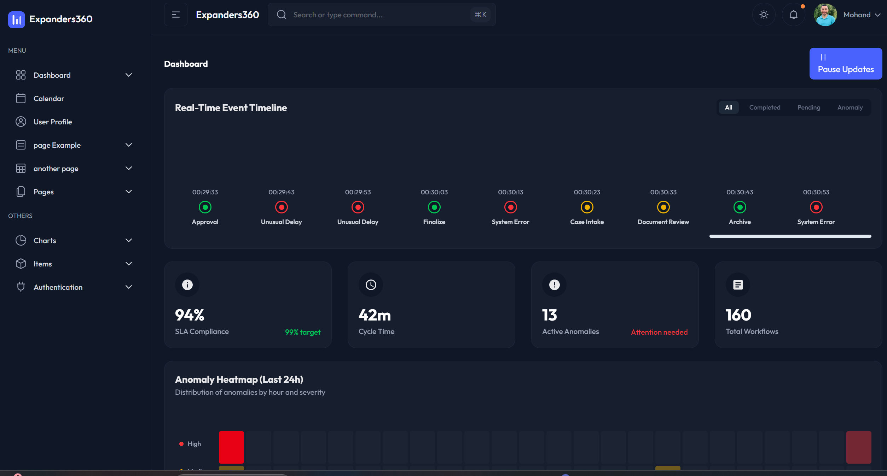
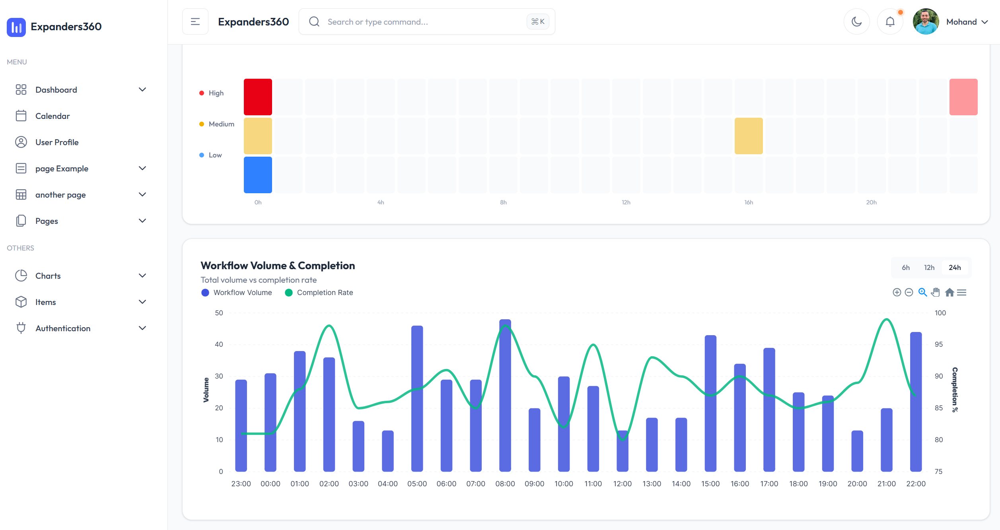
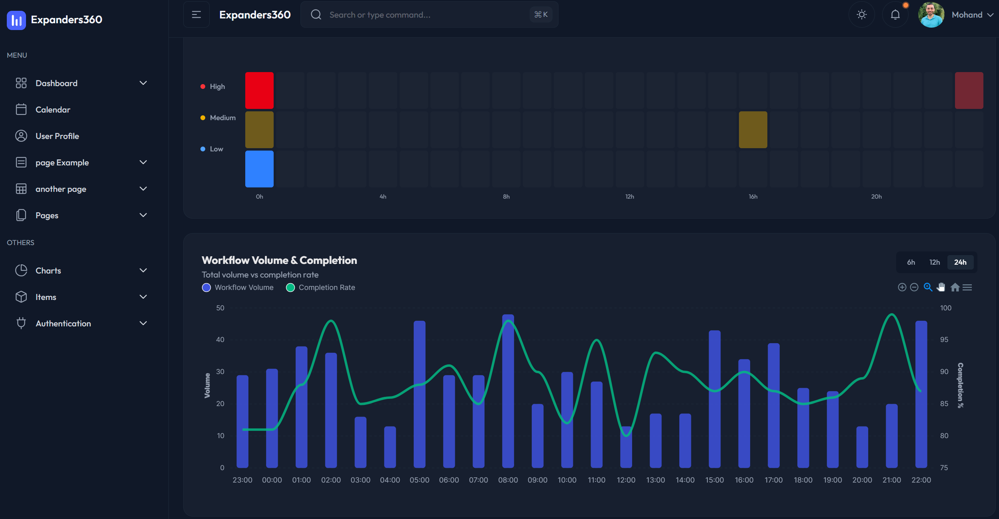
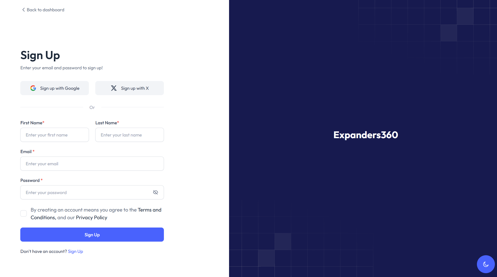
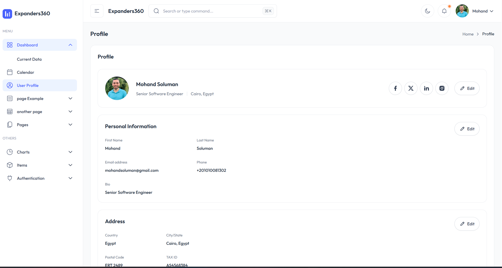

# Legal Workflow Monitoring & Anomaly Detection Dashboard

A high-performance real-time dashboard for monitoring legal workflow volumes, detecting anomalies, and tracking event timelines. Built with Angular (Signals), NgRx, Node.js, and Socket.io.

## 📸 Dashboard Preview

<p align="center">
  
  
  
  
  
  
</p>

## 🚀 Features

- **Real-time Event Timeline**: Live stream of system events with status indicators.
- **Anomaly Detection**: Visual alerts for system anomalies (High/Medium/Low severity).
- **Live Metrics**: Real-time updates for active users, TPS, error rates, and SLA compliance.
- **Interactive Charts**: Dynamic volume history visualization.
- **Simulation Control**: Pause/Resume real-time data flow.
- **Resilience**: LocalStorage caching for data persistence.

## 🏗 Architecture

This project demonstrates **Advanced Agentic Coding** principles:

- **Frontend**: Angular v19 with **NgRx Signals** for state management.
- **Reactivity**: Full **RxJS** integration for WebSocket streams and data handling.
- **Backend**: Node.js with **Socket.io** for bi-directional communication.
- **Deployment**: Docker & Docker Compose for containerized deployment.

> See [ARCHITECTURE.md](ARCHITECTURE.md) for a deep dive into design decisions, scalability, and state management strategies.

## 🛠 Getting Started

### Prerequisites

- Node.js (v18+)
- Docker (optional, for containerized run)

### Running Locally

1.  **Clone the repository**
2.  **Start the Backend**:
    ```bash
    cd server
    npm install
    node src/index.js
    ```
3.  **Start the Frontend**:
    ```bash
    cd client
    npm install
    ng serve
    ```
4.  Open `http://localhost:4200`

### Running with Docker

```bash
docker-compose up --build
```

Access the dashboard at `http://localhost:80`.

## 🧪 Testing

Run unit tests:

```bash
cd client
ng test
```

## 📈 Scalability

Designed for enterprise scale with:

- **Push-based Architecture**: Minimizes polling overhead.
- **Efficient DOM Updates**: Angular Signals + OnPush strategy.
- **Pattern-Ready**: Ready for Redis Adapter and Load Balancing (see ARCHITECTURE.md).

## ☁️ Deployment

### Prerequisites

- A GitHub repository containing this project.
- Accounts on the chosen hosting provider.

<details>
<summary><strong>Option 1: Railway (Recommended)</strong></summary>

1.  Sign up at [Railway.app](https://railway.app/).
2.  Click **New Project** > **GitHub Repo**.
3.  Select this repository.
4.  **Configuration**:
    - Railway may try to build a single Dockerfile. For this monorepo, it is best to **Deploy the `server` folder** as one service, and the `client` as another.
    - **Backend Service**: Set Root Directory to `server`. Add `PORT` variable.
    - **Frontend Service**: Set Root Directory to `client`. Build Command: `npm run build`. Start Command: `npx http-server dist/ng-tailadmin/browser -p $PORT` (add `http-server` to deps if needed).

</details>

<details>
<summary><strong>Option 2: Render</strong></summary>

**Backend (Web Service)**

1.  Root Directory: `server`
2.  Build Command: `npm install`
3.  Start Command: `node src/index.js`

**Frontend (Static Site)**

1.  Root Directory: `client`
2.  Build Command: `npm install && npm run build`
3.  Publish Directory: `dist/ng-tailadmin/browser`
4.  **Important**: Add a Rewrite Rule: Source `/*`, Destination `/index.html`, Action `Rewrite`.

</details>

<details>
<summary><strong>Option 3: Azure App Service</strong></summary>

1.  **Backend**: Deploy `server` folder to a Node.js Web App.
2.  **Frontend**: Run `ng build` and deploy the `dist` folder to an Azure Static Web App.

</details>
